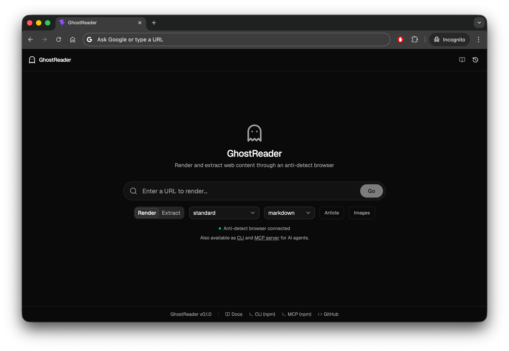

# GhostReader

[](https://www.npmjs.com/package/ghostreader)
[](https://www.npmjs.com/package/ghostreader-mcp)

Self-hosted anti-detect browser rendering proxy with AI-powered content processing. Render any URL to clean markdown through a stealth browser, extract structured data, and optionally restructure content with AI.



## Use Cases

- **AI agents** — give your LLM access to any website via MCP, without getting blocked
- **Private search** — use as a SearXNG backend to render Google/News results through a stealth browser
- **Web scraping** — render JS-heavy SPAs and get clean markdown, not raw HTML soup
- **Research** — extract and format content from any page into structured, readable output
- **Content pipelines** — feed clean markdown into RAG systems, databases, or downstream processing

## Quick Start

```bash
# Docker Compose
git clone https://github.com/klosowsk/ghostreader
cd ghostreader && docker compose up -d --build

# CLI
npx ghostreader render https://example.com

# API
curl http://localhost:3000/render/https://example.com
```

## Architecture

```
                   ┌────────────────────────────────────┐
                   │         GhostReader                │
  Web UI ──────┐   │                                    │
  CLI ─────────┤   │  Processor                         │
  MCP agents ──┤──▶│  ├─ Content extraction             │
  SearXNG ─────┤   │  ├─ AI formatting (optional)       │
  curl/API ────┘   │  └─ Extraction profiles            │
                   │         │                          │
                   │         ▼                          │
                   │  Scraper                           │
                   │  ├─ Anti-detect browser            │
                   │  ├─ Persistent identity/cookies    │
                   │  └─ GeoIP fingerprint matching     │
                   └────────────────────────────────────┘
```

## Packages

| Package | Description | Install |
|---------|-------------|---------|
| [**processor**](packages/processor) | Content processing API + Web UI | Docker |
| [**scraper**](packages/scraper) | Anti-detect browser service | Docker |
| [**cli**](packages/cli) | Command-line tool | `npm i -g ghostreader` |
| [**mcp**](packages/mcp) | MCP server for AI agents | `npm i -g ghostreader-mcp` |
| [**ui**](packages/ui) | React web interface | Embedded in processor |

## Engines

| Engine | Speed | Description |
|--------|-------|-------------|
| **standard** | ~2-5s | Fast content extraction + markdown. No AI needed. |
| **ai** | ~5-15s | AI-powered restructuring. Turns noisy pages into clean tables and lists. |

## Documentation

See the [full documentation](docs/docs.md) or visit `/docs` on any running instance:

- API reference
- CLI commands
- MCP setup (Claude Desktop, Cursor, OpenCode)
- Self-hosting (Docker Compose, Kubernetes)
- SearXNG integration

## License

MIT
